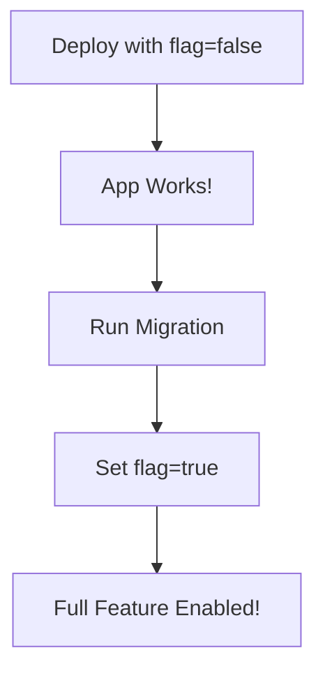
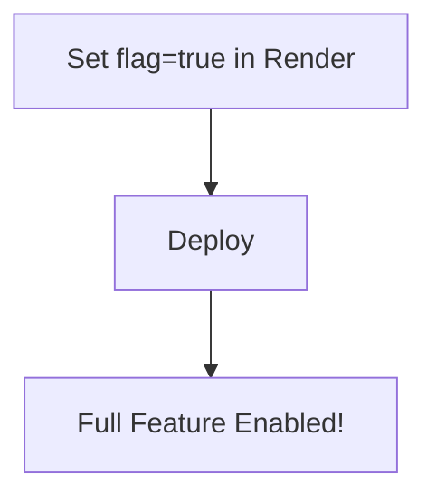

# Fix for Render 500 Error - Deployment Guide

## Problem
The `candidate_users` table doesn't exist in your Render dev environment, causing a 500 error when fetching candidates.

## Solution
The code is now **backward compatible** using a feature flag system.

---

## Quick Fix (Deploy Now)

### Step 1: Commit and Push Changes

```bash
git add .
git commit -m "Fix: Add feature flag for multi-user assignment (backward compatible)"
git push origin dev
```

### Step 2: Wait for Render to Deploy
- Go to Render Dashboard
- Wait 2-3 minutes for auto-deploy
- Check logs for: `✓ Database migrations completed successfully`

### Step 3: Verify the Fix
- Go to: `https://flask-app-dev-70xj.onrender.com`
- Login as admin
- Navigate to Candidates section
- ✅ **Should work now!** (without multi-user assignment feature)

---

## Enable Multi-User Assignment Feature

Once the app is working, you can enable the full multi-user assignment feature:

### Option 1: Enable in Render Environment Variables (Recommended)

1. Go to Render Dashboard → Your Service → Environment
2. Add new environment variable:
   ```
   ENABLE_MULTI_USER_ASSIGNMENT=true
   ```
3. Click "Save Changes"
4. Render will automatically redeploy
5. ✅ Multi-user assignment feature is now enabled!

### Option 2: Enable Locally

Update your local `.env` file:
```env
ENABLE_MULTI_USER_ASSIGNMENT=true
```

---

## How It Works

### Feature Flag System

**Environment Variable:** `ENABLE_MULTI_USER_ASSIGNMENT`
- `false` (default): Single user assignment only (backward compatible)
- `true`: Multi-user assignment enabled (requires migration)

### When Flag is `false` (Default):
- ✅ App works without `candidate_users` table
- ✅ No 500 errors
- ✅ Candidates can be assigned to one user (creator)
- ✅ All existing functionality works
- ❌ Multi-user assignment disabled

### When Flag is `true`:
- ✅ Full multi-user assignment feature
- ✅ `candidate_users` table and relationships active
- ✅ Can assign candidates to multiple users
- ✅ All users can see their assigned candidates
- ⚠️ Requires migration to be run first

---

## Deployment Workflow

### For New Environment (No Migration Run Yet):



1. Deploy code (flag defaults to `false`)
2. App works without errors
3. Migration runs automatically via `build.sh`
4. Enable feature flag (`ENABLE_MULTI_USER_ASSIGNMENT=true`)
5. Full multi-user assignment feature activated

### For Existing Environment (Migration Already Run):



1. Set `ENABLE_MULTI_USER_ASSIGNMENT=true` in Render
2. Deploy
3. Done!

---

## Verification Steps

### 1. Check if Feature is Disabled (Default)

**Admin Dashboard - Candidates Table:**
- Column shows: "Creator" (not "Assigned Users")
- `assigned_users` in API response: `[]` (empty array)
- Can create candidates with single user
- Works without errors ✅

### 2. Check if Feature is Enabled

**Admin Dashboard - Candidates Table:**
- Column shows: "Assigned Users"
- Can select multiple users in "Assign Users" dropdown
- `assigned_users` in API response: Array of user objects
- All assigned users can see the candidate ✅

---

## Troubleshooting

### Still Getting 500 Error After Deploy

**Check 1: Deployment Logs**
```bash
# In Render Dashboard → Logs, look for:
✓ Dependencies installed
✓ Database migrations completed successfully
Build completed successfully!
```

**Check 2: Try Manual Migration**
```bash
# In Render Shell
cd backend
flask db upgrade
```

**Check 3: Check Migration Status**
```bash
# In Render Shell
cd backend
flask db current
flask db heads
```

### Feature Flag Not Working

**Verify Environment Variable:**
```bash
# In Render Shell
echo $ENABLE_MULTI_USER_ASSIGNMENT
# Should output: true or false
```

**Restart Service:**
- Sometimes Render needs a manual restart after adding env vars
- Go to Settings → Manual Deploy → Deploy Latest Commit

### Migration Creates Multiple Heads

```bash
# In Render Shell
cd backend
flask db heads  # Check heads
flask db merge heads  # Merge if needed
flask db upgrade
```

---

## Rollback Instructions

### Disable Feature

Set environment variable:
```
ENABLE_MULTI_USER_ASSIGNMENT=false
```

This will:
- ✅ Keep app working
- ✅ Disable multi-user relationships
- ✅ Prevent errors if table is missing
- ⚠️ Multi-user assignments won't be visible (but data is preserved)

### Full Rollback (Remove Feature Completely)

```bash
# Revert code changes
git revert HEAD
git push origin dev

# Optionally: Drop the table
# In Render Shell
cd backend
python -c "
from app import create_app
from app.models import db
app = create_app()
with app.app_context():
    db.engine.execute('DROP TABLE IF EXISTS candidate_users CASCADE')
"
```

---

## Testing Checklist

### Without Feature Flag (Default):
- [ ] Admin can login
- [ ] Can see list of candidates
- [ ] Can create new candidate with single user
- [ ] Can edit candidate
- [ ] Can delete candidate
- [ ] User can see their candidates
- [ ] No 500 errors

### With Feature Flag Enabled:
- [ ] Admin can see "Assign Users" field (multi-select)
- [ ] Can select multiple users when creating candidate
- [ ] All assigned users appear in table
- [ ] Each assigned user can see the candidate in their dashboard
- [ ] Can edit and reassign users
- [ ] Filter by assigned user works

---

## Summary

✅ **Immediate Fix:** Deploy code now, app will work without errors  
✅ **Migration:** Will run automatically via `build.sh`  
✅ **Enable Feature:** Set `ENABLE_MULTI_USER_ASSIGNMENT=true` when ready  
✅ **No Downtime:** Can enable/disable feature anytime  

**Current Status:**
- Local: Feature disabled by default
- Render Dev: Feature disabled (will be fixed after deploy)
- After Migration: Can enable feature anytime with env var

---

## Next Steps

1. **NOW:** Deploy the backward compatible code
2. **WAIT:** Let migration run automatically
3. **VERIFY:** Check that candidates list works
4. **LATER:** Enable feature flag when ready for multi-user assignment

The app will work perfectly without the feature enabled, and you can enable it whenever you're ready!

